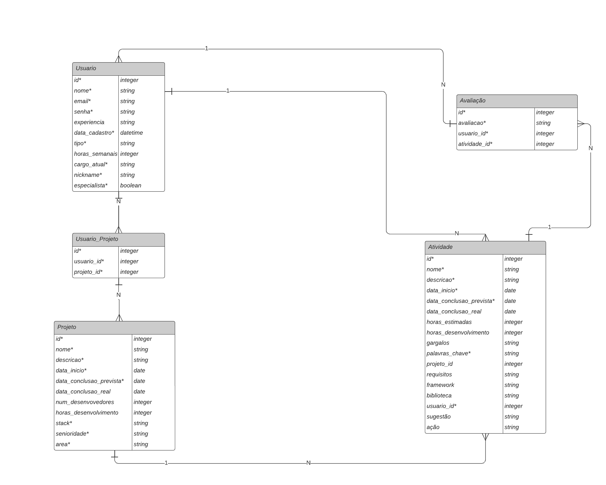

# back-end projetão: estiMate

O back-end está dividido em:
* Back-end (fastapi + sqlalchemy + uvicorn + docker)
* Banco de dados (serverless postgresql)

Modelo Relacional Banco:



### Como executar:

Abra o terminal

Execute no repositório raiz:

```
python -m venv env
env\Scripts\activate
```

**Instale as bibliotecas necessárias!**

Após isso, vá ao repositório em /app e execute:

```
pip freeze > requirements.txt
```
Após isso, crie um arquivo texto em /app chamado '.env'

Coloque dentro do arquivo o link de um banco que seja aceito na biblioteca **sqlalchemy**

```
DATABASE_URL: "<link conexão banco>"
```

Após isso, na raiz do projeto, execute, com o docker local aberto:

```
docker-compose up --build
```

Portas:

Swagger:
https://localhost:8000/docs